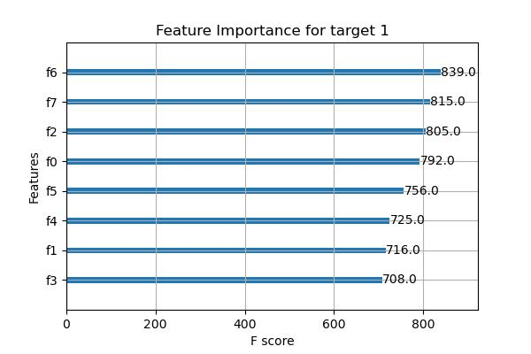
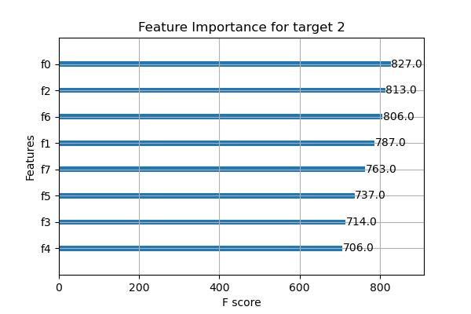

# dask_xgboost_regression
A xgboost regressor witht he support of dask for processing large dataset. I test the input with 1000000 rows with 10 input features and with 2 output features. 
## Feature importance

